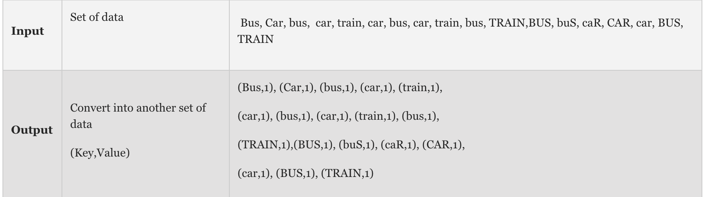
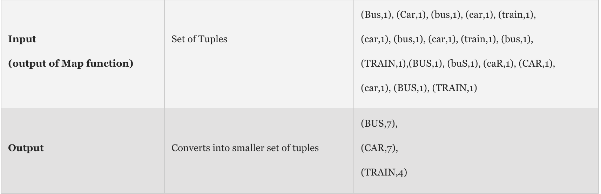

## Big-Data
**Hadoop &amp; Mapreduce**

In Hadoop, MapReduce is a computation that decomposes large manipulation jobs into individual tasks that can be executed in parallel cross a cluster of servers. The results of tasks can be joined together to compute final results.

**[MapReduce]** consists of 2 steps:
+ **Map Function**  – It takes a set of data and converts it into another set of data, where individual elements are broken down into tuples (Key-Value pair).

+ **Reduce Function** – Takes the output from Map as an input and combines those data tuples into a smaller set of tuples.

+ **Work Flow of Program**

